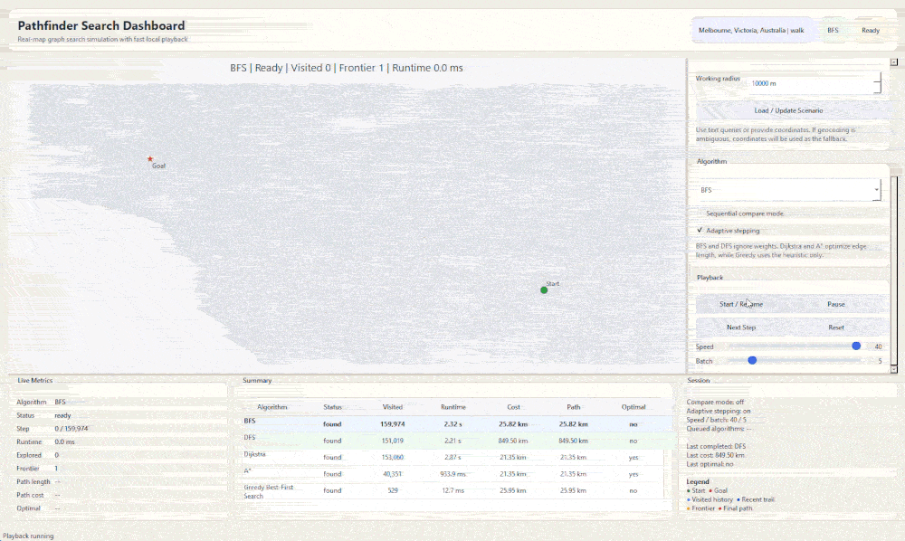

# Pathfinder Search Dashboard



This project is a local Python desktop app for replaying classic graph search algorithms on a real OpenStreetMap road network. It keeps `OSMnx` for map download/caching, `NetworkX` for the graph/search logic, and now uses `PySide6` + `PyQtGraph` for a faster, more spacious simulation dashboard.

The default scenario uses Melbourne only as a demo:

- Place: `Melbourne, Victoria, Australia`
- Start: `Monash University Clayton campus`
- Goal: `State Library Victoria, Melbourne`

You can change the city, network type, start, and goal without touching the core search or visualization code.

## Files

- `main.py`: CLI entry point, scenario loading, headless summary mode, and app launch
- `algorithms.py`: BFS, DFS, Dijkstra, A*, and Greedy Best-First Search with replay traces
- `map_utils.py`: OSM loading, caching, geocoding, nearest-node lookup, and graph helpers
- `ui.py`: PySide6 desktop window, controls, metrics panels, and playback orchestration
- `visualization.py`: PyQtGraph map canvas, layered overlays, and rendering helpers
- `config.py`: editable defaults for place, endpoints, network type, speed, and playback tuning
- `requirements.txt`: Python dependencies

## Features

- Real road/walking/bike networks from OpenStreetMap
- Configurable:
  - `place_name`
  - `network_type`
  - `start_query`
  - `goal_query`
  - direct coordinates for start/goal
  - selected algorithm
  - animation speed
  - batch stepping
- Resizable PySide6 desktop dashboard with:
  - large main map area
  - right control sidebar
  - lower metrics and summary panels
  - splitter-based layout
- Fast PyQtGraph rendering:
  - base map drawn once
  - lightweight overlay updates during playback
  - brighter recent search trail
  - emphasized frontier
  - final path overlay
- Route update workflow from the UI with background scenario loading
- Sequential compare mode
- Metrics for every algorithm:
  - runtime
  - explored nodes
  - path cost
  - path length
  - found/not found
  - optimal/not optimal under the chosen weighting
- Optional CSV export of summary metrics
- Local graph caching in `cache/graphs/`

## Installation

Activate your environment, then install the dependencies:

```powershell
conda activate pathfinder
pip install -r requirements.txt
```

Or use the environment Python directly:

```powershell
C:\Users\han\anaconda3\envs\pathfinder\python.exe -m pip install -r requirements.txt
```

## Run

Default Melbourne demo:

```powershell
python main.py
```

Or:

```powershell
C:\Users\han\anaconda3\envs\pathfinder\python.exe main.py
```

The first run can take a while because the app downloads/caches the map and precomputes all algorithm traces. After that, reruns are much faster.

## Dashboard layout

- The map is the main visual focus on the left.
- The right sidebar contains:
  - `Route Setup`
  - `Algorithm`
  - `Playback`
- The lower panel contains:
  - live metrics
  - a summary table for all algorithms
  - session/legend information

## Controls

- `Load / Update Scenario`: load a new city/start/goal/network combination
- `Start / Resume`: begin playback
- `Pause`: stop playback without resetting
- `Next Step`: advance one search step
- `Reset`: restart the current algorithm replay
- `Speed`: increases base playback rate
- `Batch`: advances multiple search steps per timer tick
- `Sequential compare mode`: automatically rolls through the algorithms
- `Adaptive stepping`: slower near the start/end, faster in the middle of long runs

## Configuration

Edit `config.py`, or override settings from the CLI.

Example defaults:

```python
DEFAULT_CONFIG = SimulationConfig(
    place_name="Melbourne, Victoria, Australia",
    network_type="walk",
    start_query="Monash University Clayton campus",
    goal_query="State Library Victoria, Melbourne",
    graph_radius_m=12000.0,
    animation_speed=8.0,
    batch_steps=1,
    compare_mode=False,
    selected_algorithm="A*",
)
```

The default demo uses a route-centered graph radius so the working graph stays reasonable.

## CLI examples

Start on Dijkstra:

```powershell
python main.py --algorithm Dijkstra
```

Enable compare mode:

```powershell
python main.py --compare-mode
```

Increase playback throughput:

```powershell
python main.py --animation-speed 12 --batch-steps 3
```

Use another city:

```powershell
python main.py `
  --place-name "Sydney, New South Wales, Australia" `
  --start-query "University of Sydney" `
  --goal-query "Sydney Opera House" `
  --network-type walk
```

Use direct coordinates:

```powershell
python main.py `
  --place-name "Melbourne, Victoria, Australia" `
  --start-lat -37.9106 --start-lon 145.1362 `
  --goal-lat -37.8097 --goal-lon 144.9653
```

## Large-region performance

If a place is large, use a working graph radius so the app loads a point-centered subgraph around the route corridor instead of the whole place:

```powershell
python main.py `
  --place-name "Victoria, Australia" `
  --start-query "Monash University Clayton campus" `
  --goal-query "State Library Victoria, Melbourne" `
  --graph-radius-m 12000
```

When `--graph-radius-m` is set, the app downloads a graph around the midpoint between start and goal, expanded by the straight-line distance plus a buffer.

## Algorithm notes

- BFS and DFS ignore edge weights by design.
- Dijkstra and A* use OSM edge `length` as the route cost.
- A* uses straight-line geographic distance to the goal as the heuristic.
- Greedy Best-First Search uses only the heuristic and is not guaranteed to be optimal.
- Dijkstra and A* should match on weighted path cost when both find a path.

## Headless mode

You can still precompute everything without launching the GUI:

```powershell
python main.py --no-gui --metrics-csv outputs/search_metrics.csv
```

The CSV includes:

- runtime
- explored nodes
- path cost
- path length
- found/not found
- optimal/not optimal

## Geocoding notes

- Queries work best when they are specific, for example `State Library Victoria, Melbourne`.
- The resolver tries both the raw query and a place-qualified variant such as `<query>, <place_name>`.
- If geocoding fails or is ambiguous, provide explicit coordinates instead.
